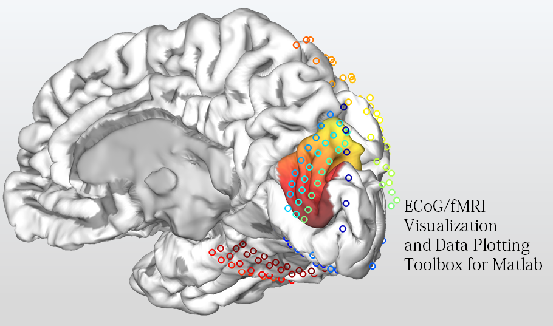

## The ECoG/fMRI visualization and data plotting toolbox for Matlab

This toolbox provides functions to visualize 3D brain models in Matlab, as well as to flexibly plot data on and around the brain surfaces. The toolbox includes a 
demo script and data to get you quickly familiarized with it. All functions include comprehensive documentation; type 'help <function name> to access description and usage instructions. 

### Main functions: 

plot_mesh_brain: reads a mesh object (structure defined with cortices and faces) and plots it as a 3D patch object with graphical properties suitable for the presentation of cortical surfaces. 

plot_data_on_mesh: plots data on the brain patch object, either by coloring its surface according to a colormap or by adding a scatter plot object. This function is suitable both for presenting data from intracranial electrodes as well as for coloring entire surface regions as for fMRI data. Multiple layers of data can be presented with separete color maps. 

paint_mesh: a simpler function to paint all or part of the mesh surface. This function is called by plot_data_on_mesh, but for fmri-type data it is probably more suitable as it requires less tuning of the input arguments. 

### Additional functions: 

read_freesurfer_brain: this is a function which can be used on machines which have FreeSurfer installed to import cortical surfaces from brain scans which have been processed by FreeSurfer into Matlab. 

fix_lighting: this is a simple function which corrects the angle of lighting to "headlight". It is needed since rotation of the brain objects also rotates the lighting angle. Alternatively to using this function, click anywhere on the figure created by plot_data_on_mesh. 

pull_3d_scatter_dots: this function "pulls" scatter plot objects toward the viewing angle. This is useful since markers plotted directly on the cortical surface are often "submerged" in it. 

### Demo script: 

Open "demo_script.m" and run it cell-by-cell or line-by-line to get familiarized with the above functions.

### Copyright and citation:

Toolbox written by Edden M. Gerber, lab of Leon Deouell, Hebrew University of Jerusalem 2015. 

This toolbox uses "FreezeColors.m" written by John Iversen 2005-10, john_iversen@post.harvard.edu. 

Thanks to Tal Golan for theoretical and technical assistance. 

There is no citation currently associated with this toolbox, but if you are using it please let me know at edden.gerber@gmail.com. Also please feel free to send feedback, bug reports etc. 

### Bugs and issues:
There are some issues related to changes in the color scheme of scatter plot objects when surfaces are painted. This is a problem with the external "FreezeColors" function. To avoid this issue it is best to paint surfaces before adding a scatter plot. 
